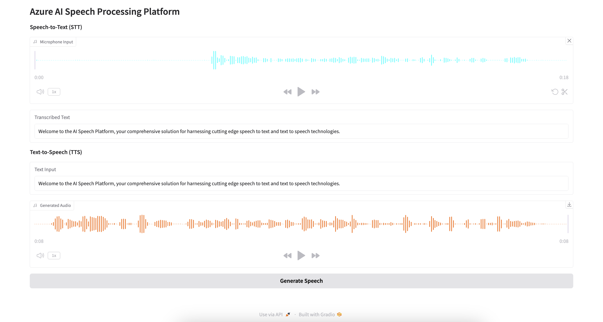

# **Azure AI Speech Processing Platform**

Welcome to the **Azure AI Speech Processing Platform**, an interactive application designed for seamless Speech-to-Text (STT) and Text-to-Speech (TTS) functionalities using Azure Cognitive Services. This platform combines the power of Azure's APIs with an intuitive interface provided by Gradio, enabling efficient speech processing for developers and end-users.

---

## **Features**

- **Speech-to-Text (STT):** Convert audio inputs (e.g., microphone recordings) into accurate text transcriptions using Azure's Speech-to-Text API.
- **Text-to-Speech (TTS):** Generate natural-sounding audio from text input using Azure's Text-to-Speech API with support for customizable voices.
- **Interactive Gradio Interface:** A user-friendly interface for real-time testing and interaction.
- **Demo Examples:** Includes example outputs (`demo.png`, `demo.mp4`) to showcase the platform's capabilities.

---

## **File Structure**
```bash
project/
├── app.py              # Main application script
├── requirements.txt    # List of dependencies
├── README.md           # Project documentation
├── .env                # Environment variables (not shared in version control)
├── demo/               # Demo files showcasing platform capabilities
│   ├── demo.png        # Screenshot of the interface
│   ├── demo.mp4        # Video demonstration
└── utils/              # Utility functions for Azure APIs
    └── azure_speech.py # Helper functions for STT and TTS
```

---

## **Setup Instructions**

### **1. Clone the Repository**

Clone this repository to your local system:

```bash
git clone <repository-url>
cd project
```

### **2. Install Dependencies**

Install the required Python libraries using the `requirements.txt` file:

```bash
pip install -r requirements.txt

```

### **3. Set Up Environment Variables**
Create a ```.env``` file in the root directory with the following content:

```bash
AZURE_SPEECH_REGION=<your-region>
AZURE_SPEECH_KEY=<your-api-key>


```

### **4. Run the Application**
Start the application with:
```bash
python app.py
```
---

## **Usage** 
1. Speech-to-Text (STT):
    - Record or upload an audio file using the microphone input.
    - View the transcribed text in real-time.
2. Text-to-Speech (TTS):
    - Enter the text you want to convert to speech.
    - Download or play the generated audio file directly from the interface.

---

## **Interface Screenshot**



---

## **Demo Video**

[Watch the Demo Video](demo/demo.mp4)

---

## **Dependencies**

- [Gradio](https://gradio.app/)
- [Requests](https://docs.python-requests.org/en/latest/)
- [Azure Cognitive Services](https://azure.microsoft.com/en-us/services/cognitive-services/)

---

## **License**

This project is licensed under the [MIT License](LICENSE).

---

## **Acknowledgments**

- Powered by [Azure Cognitive Services](https://azure.microsoft.com/en-us/services/cognitive-services/).
- Interface built with [Gradio](https://gradio.app/).
